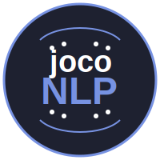

# Natural Language Processing Portfolio



## Overview

This is an interactive Natural Language Processing (NLP) portfolio built with Streamlit, showcasing various NLP techniques and models. The application provides hands-on demonstrations of different NLP concepts, from basic text processing to advanced transformer models.

## Features

- **Interactive Demos**: Try out different NLP techniques in real-time
- **Educational Content**: Learn about various NLP concepts with detailed explanations
- **Code Examples**: View implementation examples for each technique
- **Visual Results**: See visual representations of NLP processes

### Featured NLP Techniques

1. **Tokenization**
   - Text segmentation into meaningful units
   - Multiple tokenization approaches
   - Interactive text analysis

2. **Word Embeddings**
   - Word2Vec implementations
   - GloVe embeddings
   - Semantic word representations

3. **Transformer Models**
   - BERT integration
   - GPT model implementations
   - State-of-the-art language understanding

## Technologies Used

- **Python**: Core programming language
- **Streamlit**: Web application framework
- **spaCy**: Industrial-strength NLP
- **Hugging Face Transformers**: State-of-the-art models
- **NLTK**: Natural Language Toolkit

## Installation

1. Clone the repository:
```bash
git clone https://github.com/yourusername/NaturalLanguagePro.git
cd NaturalLanguagePro
```

2. Install dependencies:
```bash
pip install -r requirements.txt
```

3. Run the application:
```bash
streamlit run app.py
```

## Project Structure

```
NaturalLanguagePro/
├── app.py              # Main Streamlit application
├── utils.py            # Utility functions
├── static/             # Static assets (images, SVGs)
├── pages/             # Individual pages for each NLP concept
├── nlp_components/    # NLP processing components
└── .streamlit/        # Streamlit configuration
```

## Usage

1. Navigate to the application in your web browser (typically http://localhost:8501)
2. Use the sidebar to explore different NLP techniques
3. Each page includes:
   - Concept explanation
   - Interactive demo
   - Code examples
   - Visual results

## Contributing

Contributions are welcome! Please feel free to submit a Pull Request.

## License

This project is licensed under the MIT License - see the LICENSE file for details.

## Contact

For any questions or feedback, please open an issue in the repository. 